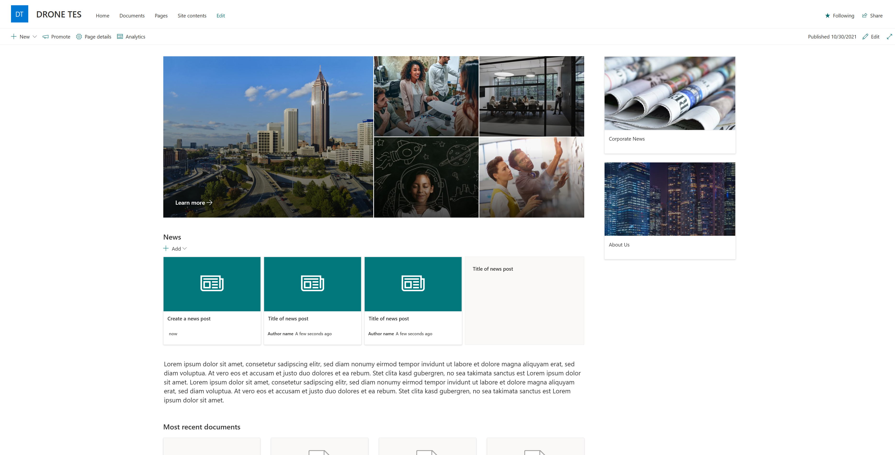

# How to create custom site templates in SharePoint online

This is an example of how to use Site Design & Site Script to create custom site template in SharePoint online:

📺check my YouTube Video tutorial to follow a step-by-step guide:
https://youtu.be/ENCBbgAa-6U

🔗Microsoft article about SharePoint site template and site script:
https://docs.microsoft.com/en-us/sharepoint/dev/declarative-customization/site-design-overview